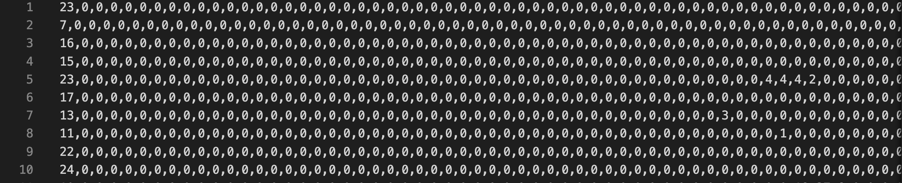
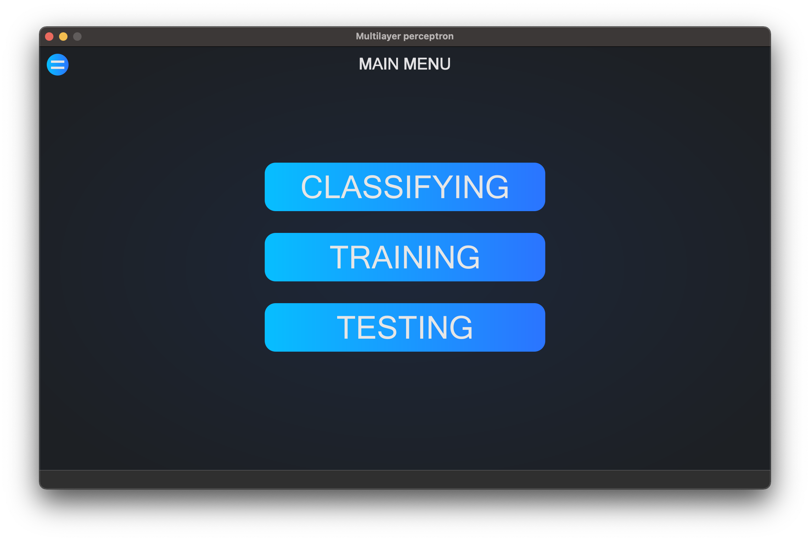
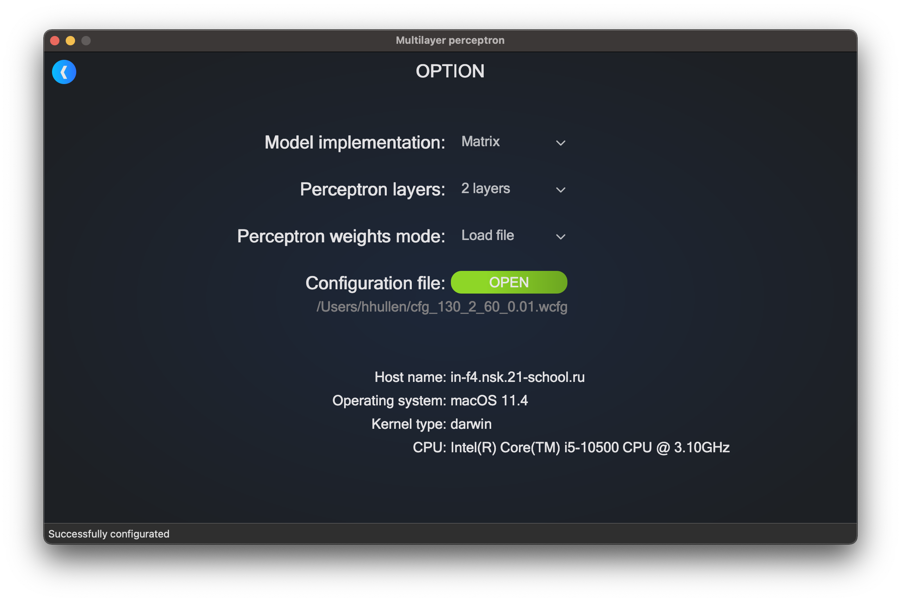
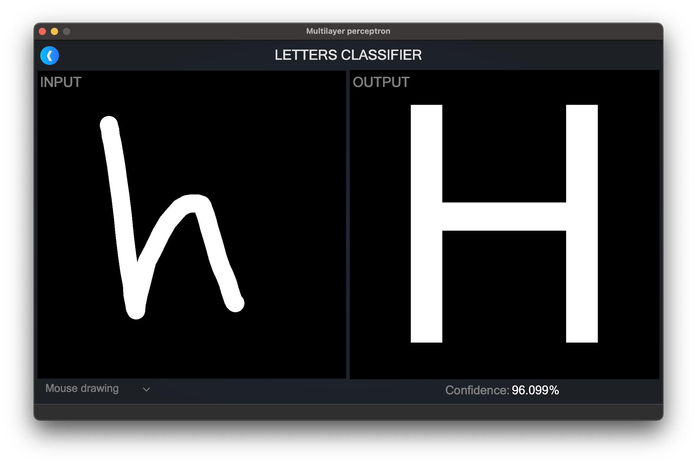
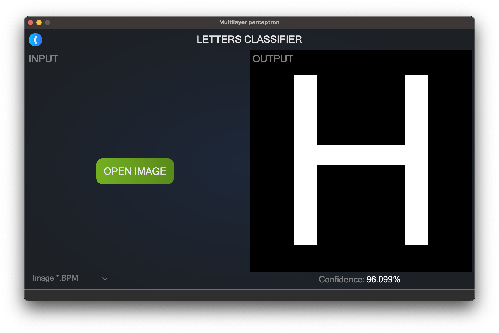
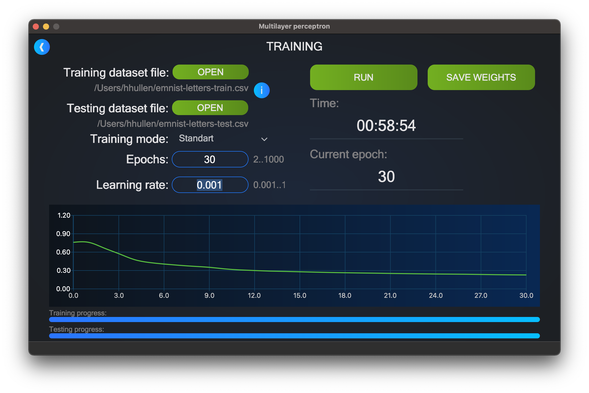
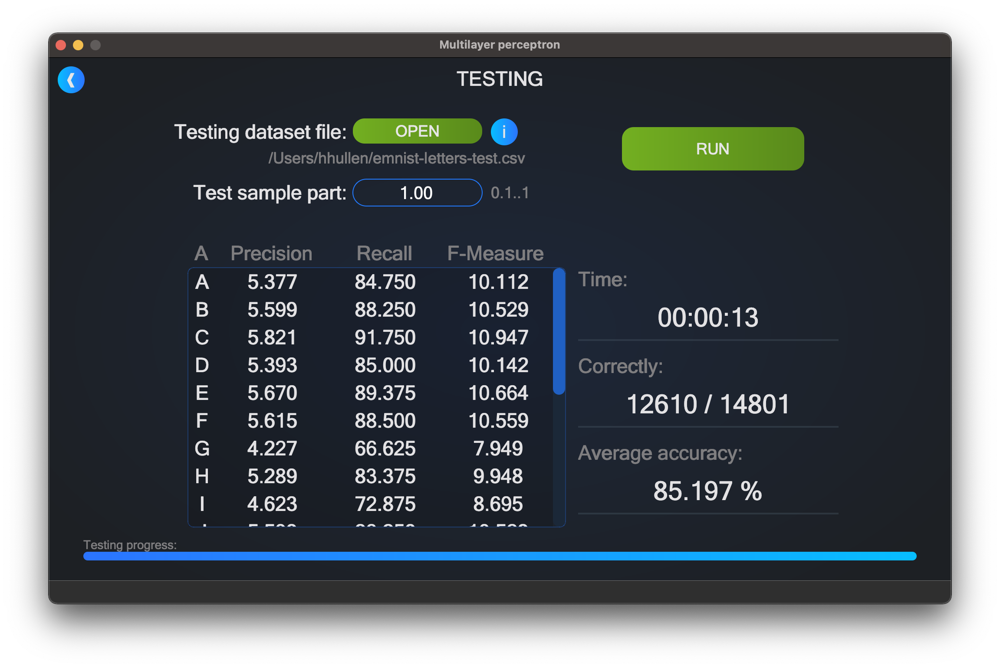

# Multilayer-Perceptron
Letters recognizer

## Short app description

The application is to classify latin letters by using neural network (multilayer perceptron). Also it is possible to train and test neural network by dataset. Training and testing dataset format should have specific format containing letter number (from 1 - 26) at first and 784 pixels values (0 - 255) separated by commas. For instance pixels values for letter "C": 3,0,0,255,255, ... 170,0,0. Some dataset examples are in ./dataset/emnist-letters folder in project root.  

The application developed in C++ language of C++17 standard using G++ compiler. As a GUI creation technology chosen QT6 library with C++ underneath. The application source code located in the src folder and can be built with Makefile which contains standard set of targets for GNU-programs: all, install, uninstall, clean, dvi, dist, tests, check, leaks(for macOS), valgring(for Linux).

## Interface

### MAIN MENU
Main menu has 4 buttons: Option, Classifying, Training and Testing.  

### OPTION
This is where the perceptron can be configured. Model implementation includes "Matrix" mode and "Graph" mode. Perceptron layers can take value from 2 to 5, which means how many hidden layers will be set. Perceptron weights mode can take "Random" or "File" value. Under "Random", the perceptron weights will be filled with randomly generated values, so it has to be trained to make it classify letters correctly. Under "File" it is possibly to choose configuration file with trained weights (.wcfg). Some trainded weights configurations are in CFG folder in the project root. In case, the configuration file have chosen but perceptron layers value do not correspond to it, at the window bottom in status bar will be shown message "Failed to setup configuration". It is necessary to load file correspondint to perceptron layers value. In case, it configurated good, in status bar will be shown message "Successfully configurated".  

### CLASSIFYING
Has two main area to classify letters. At input area it is possibe to draw letters by mouse. At output area will be shown suggested letter with its confidence below.  

Moreover, .bmp images with 512x512 size can be loaded to scan it and try to recognize letter. It is important for images to has black background and white letter on it.  

### TRAINING
Here can be loaded training and testing datasets. Trainig mode can take "Standart" or "Cross validation" values. This training methothds are different of each other. "Standart" methos requires training and testing datasets and epoch amount, thus it run through them every epoch and calculate recognition mistake that will be presented in grapg line. "Cross validation" metod required trainig dataset and groups amount. So, the dataset will be separated into defined groups amount and run through them in turn that first group become testing but other trainig. And after one run it will change testing group to next one and run through again. Learning rate field can take from 0.001 to 1 values. It is influenced to decreasing mistake rate and training accuracy. Button "Save weights" is to save current trained weights to folder that should be set.  

### TESTING
Testing: Here, the trained weights, could be tested on dataset with addition information as precision, recall, f-measure, correctly classified letters and average accuracy for the dataset.  

## Building
To install the application the "make install" command execution is required in "src" folder. The application to launch will be located in "build" folder of the project root.  

Uninstallation is done through execution "make uninstall" command. Thus, the executable file will be deleted from "build" folder.

Project made predominantly for MacOS, also, probably can be build  for Linux without any serious trouble.